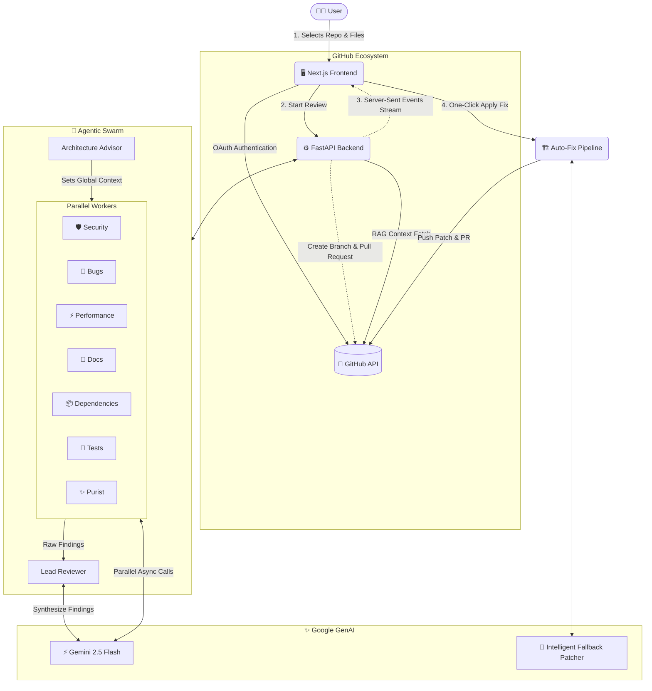

<div align="center">
  <div style="background: rgba(14, 165, 233, 0.1); padding: 20px; border-radius: 24px; display: inline-block; margin-bottom: 20px;">
    <h1 style="margin: 0; font-size: 3rem; color: #0ea5e9;">CodeReview Crew</h1>
  </div>
  <h3>The Ultimate Agentic Swarm for Deep Codebase Analysis</h3>
</div>

---

## 🛑 The Problem: Why Code Review Crew is Needed

In modern software engineering, code reviews are universally recognized as a massive bottleneck. The traditional workflow is broken for several reasons:

1. **The Human Bottleneck:** Pull Requests (PRs) often sit idle for days because Senior Engineers are too busy building to review. When they finally do review, they are prone to human error, fatigue, and context-switching fatigue.
2. **"Single-Prompt" AI Reviewers Fail:** Many teams try to solve this by dumping their code into ChatGPT or GitHub Copilot. However, prompting a single LLM to act as a monolithic "Code Reviewer" yields disastrous results. The AI becomes overwhelmed, returning a noisy mix of useless stylistic nitpicks, hallucinations, and generic advice, completely missing deep architectural or security flaws.
3. **Context Ignorance:** Standard AI tools review individual files in a vacuum. If `utils.py` changes, the AI doesn't know that it breaks a legacy authentication flow in `routes.py`.
4. **The "Fixing" Friction:** Even when static analysis tools (like SonarQube) find a bug, they just spit out a log file. The developer still has to go back, figure out the patch, test it, and push another commit. 

Code Review Crew solves **all** of these problems by bringing the concept of **Swarm Intelligence** and **Retrieval-Augmented Generation (RAG)** into the code review lifecycle.

---

## 🎯 Who is it for?

Code Review Crew is designed for engineering organizations that want to merge code faster without compromising on quality or security.

- **Tech Leads & Staff Engineers:** Offload the mundane task of reviewing syntax, style, and basic logic flaws. Set up custom Swarm Guidelines (e.g., "Enforce SOLID principles" or "Ban nested loops") so the AI enforces your exact architectural standards automatically.
- **Security Engineers:** Rest easy knowing that every single PR is aggressively interrogated by a dedicated *Security Sentinel* agent whose sole prompt instruction is to hunt for injection vulnerabilities, exposed secrets, and auth bypasses.
- **Open Source Maintainers:** Automatically triage and review PRs from hundreds of unknown contributors instantly, ensuring massive codebases remain stable.
- **Junior Developers:** Receive instant, mentor-like feedback on code quality, test coverage, and documentation before ever submitting a PR to a senior colleague.

---

## 🌟 The Solution: A 9-Agent Hierarchical Swarm

Instead of a monolithic AI, Code Review Crew deploys a structured, hierarchical Swarm. By giving each agent a highly constrained, narrow "focus area", we completely eliminate LLM hallucination and ensure incredibly deep, expert-level analysis.

### 🏛️ The Architect (Phase 1: Synchronous)
* **Architecture Advisor:** Runs before anyone else. It traverses the repository structure, analyzes `package.json` or `pyproject.toml`, maps out the global dependency tree, and sets the "Global Context" for the rest of the swarm.

### 🏃‍♂️ The Workers (Phase 2: Parallel)
Once the context is set, **7 independent agents execute concurrently** via `asyncio`.
1. 🛡️ **Security Sentinel:** Blind to style and formatting. It exclusively hunts for OWASP top 10 vulnerabilities, insecure cryptography, and authorization bypasses.
2. 🐛 **Bug Detective:** Scans for edge-case logic errors, race conditions, null pointer exceptions, and unhandled asynchronous promises.
3. ⚡ **Performance Profiler:** Identifies Big-O time complexity issues, N+1 database query problems, and memory leaks.
4. ✨ **Code Purist:** The strict linter. Enforces clean code principles, DRY (Don't Repeat Yourself), SOLID architecture, and highly readable variable naming.
5. 📝 **Documentation Auditor:** Ensures complex logic has JSDoc/Docstrings and that existing comments haven't drifted from what the code actually does.
6. 🧪 **Test Coverage Analyst:** Identifies critical paths that lack unit testing and suggests specific mocking strategies for integration tests.
7. 📦 **Dependency Guardian:** Checks if newly imported third-party packages are secure, optimized, or if native standard libraries could be used instead.

### 🧑‍⚖️ The Aggregator (Phase 3: Synchronous)
* **Lead Reviewer:** The 7 parallel workers generate massive amounts of raw JSON data. The Lead Reviewer takes this data, removes any overlapping/duplicate findings, resolves conflicts (e.g., if the Purist suggests a change that the Profiler says is too slow), and formats the final interactive report.

---

## 🚀 Technical Deep Dive & Innovations

This project was built from the ground up to showcase the immense power, speed, and tooling capabilities of the **Gemini 2.5 Flash** ecosystem. 

### 1. Retrieval-Augmented Generation (RAG) for Codebases
A major issue with AI reviews is context loss. We heavily utilize RAG to inject deep repository context into our workflow. When an agent reviews a file, the backend dynamically fetches the content of the functions being imported from *other* files in the GitHub repository via the GitHub REST API. This ensures the swarm delivers hyper-accurate, project-specific insights rather than generic, localized advice.

### 2. Intelligent Two-Step Auto-Fix Engine (GitHub PR Integration)
Identifying a bug is only half the battle. Our platform automatically generates unified Git diffs for every finding. When a developer clicks **"Apply Fix"**, our backend intercepts the diff and executes a resilient patching pipeline:
- **Step 1 (Deterministic Patch):** We use a strict Python parsing library to apply the standard unified diff directly to the file payload. 
- **Step 2 (Gemini Fallback Merge):** Because LLMs sometimes generate "fuzzy" or poorly spaced diffs that cause strict patchers to crash, we built a fallback system. If Step 1 fails, we pass the broken diff and the original file to **Gemini 2.5 Flash** as a dedicated "Merge Engine". Gemini perfectly weaves the fix into the code, guaranteeing a clean file payload.
- **Step 3 (GitHub Integration):** The backend immediately creates a new Git branch, pushes the patched blob, and opens a Pull Request directly on your GitHub repository.

### 3. Real-Time Server-Sent Events (SSE) Streaming
Executing 8 LLM calls takes time. If we used standard REST, the browser would timeout or the user would stare at a loading spinner for 30 seconds. Instead, we built a custom **Server-Sent Events (SSE)** streaming pipeline from the Python FastAPI backend to the Next.js frontend. As soon as an individual agent (like the *Security Sentinel*) finishes its analysis, it instantly streams that JSON chunk over the open TCP connection. The React frontend eagerly renders the finding inline, creating a blazing-fast, staggered UI reveal.

### 4. Interactive 2D Architecture Graph
Understanding a massive enterprise repository visually is critical. We integrated `react-force-graph-2d` using the HTML5 Canvas API to render an interactive, physics-based node graph of the codebase. By analyzing folder structures, we map out dependencies visually, allowing developers to pan, zoom, and physically interact with their repository's architecture before deploying the Swarm.

---

## 🚀 Swarm Architecture & System Flow



---

## 🛠️ Tech Stack & Architecture

| Category | Technology | Purpose |
| :--- | :--- | :--- |
| **Frontend Framework** | `Next.js 15` (App Router) | Core React framework for building the UI, routing, and state management. |
| **Styling & UI** | `Tailwind CSS`, `lucide-react` | Utility-first styling for the premium "Bento Box" dashboard. |
| **Visualization** | `react-force-graph-2d` | HTML5 Canvas-based 2D Physics Graph for architecture visualization. |
| **Authentication** | `NextAuth.js` | Managing secure GitHub OAuth login flows to access private repositories. |
| **Backend API** | `Python 3.12`, `FastAPI` | High-performance asynchronous backend server tailored for AI orchestration. |
| **AI Integration** | `google-genai` SDK | Official Gemini SDK to interact with `Gemini 2.5 Flash`. |
| **Concurrency** | `asyncio` | Python library to run the Swarm in true parallel without blocking threads. |
| **Data Streaming** | `Server-Sent Events (SSE)` | Streaming agent findings in real-time to the Next.js client. |
| **Deployment** | `Google Cloud Run` | Serverless container hosting for massive scalability of both Frontend and Backend. |
| **CI/CD** | `Google Cloud Build` | Continuous automated deployment from the GitHub repository. |

---

## 💻 Running Locally

### 1. Backend Setup
```bash
cd backend
python -m venv .venv
source .venv/bin/activate  # On Windows: .venv\Scripts\activate
pip install uv
uv pip install -r pyproject.toml
```
Create a `.env` in the `backend` directory:
```env
GEMINI_API_KEY=your_gemini_api_key
```
Start the server:
```bash
uvicorn main:app --reload
```

### 2. Frontend Setup
```bash
cd frontend
npm install
```
Create a `.env.local` in the `frontend` directory:
```env
GITHUB_ID=your_github_oauth_client_id
GITHUB_SECRET=your_github_oauth_client_secret
NEXTAUTH_URL=http://localhost:3000
NEXTAUTH_SECRET=a_random_secure_string
NEXT_PUBLIC_API_URL=http://localhost:8000
```
Start the frontend:
```bash
npm run dev
```
